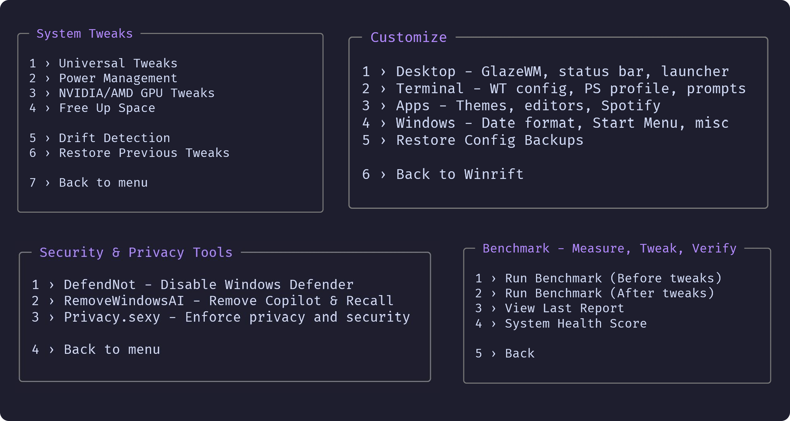

# Winrift

**Break through default Windows.** Measure every tweak, prove every change — 13 system metrics, before and after.

<p align="center">
	
</p>

<div align="center">
 <p>
 <a href="https://github.com/emylfy/winrift/stargazers"></a>&nbsp;&nbsp;
 <a href="https://github.com/emylfy/winrift/blob/main/LICENSE"></a>&nbsp;&nbsp;
 <a href="https://github.com/emylfy/winrift/commits/main/"></a>&nbsp;&nbsp;
 <a href="https://github.com/emylfy/winrift/releases"></a>
 </p>
</div>

<p align="center">
	<a href="#install">Install</a> •
	<a href="#benchmark--dont-trust-verify">Benchmark</a> •
	<a href="#features">Features</a> •
	<a href="#compatibility">Compatibility</a>
</p>

> **No other tool covers this complete pipeline:** Measure → Optimize → Verify → Customize

---

## Install

Open PowerShell as Admin (`Win + X` → Terminal Admin) and run:

```powershell
irm https://raw.githubusercontent.com/emylfy/winrift/main/scripts/launch.ps1 | iex
```

A restore point is created automatically before any system changes.

<details>
<summary>Create a persistent Start Menu shortcut</summary>

```powershell
irm https://raw.githubusercontent.com/emylfy/winrift/main/scripts/install.ps1 | iex
```

</details>

> **Security note:** This is a common PowerShell install pattern (similar to `curl | sh`). The full source code is open at [github.com/emylfy/winrift](https://github.com/emylfy/winrift). All external scripts are verified with SHA256 hashes before execution.

---

## Benchmark — Don't Trust, Verify

Other tools apply tweaks and hope for the best. Winrift measures 13 system metrics before and after — so you see exactly what changed.

> Typical results on clean Windows 11 24H2 (your numbers will vary):

| Running processes |       142 |       98 |   -31% |

<sub>Full methodology and metric explanations: <a href="docs/tests.md">Testing & Benchmarks Guide</a></sub>

---

## Features

<p align="center">
	
</p>

| Feature                                        | What it does                                                                                          |
| :--------------------------------------------- | :---------------------------------------------------------------------------------------------------- |
| **[Benchmark](docs/tests.md)**                 | Measure 13 system metrics before and after tweaks                                                     |
| **[Health Score](docs/health_score.md)**       | 0-100 system rating across 7 categories with delta tracking and recommendations                       |
| **[System Tweaks](docs/tweaks_guide.md)**      | 13 optimization categories — latency, input, SSD, GPU, network, CPU, power, boot, UI, memory, DirectX |
| **[Drift Detection](docs/drift_detection.md)** | Monitors whether Windows Updates revert tweaks; auto-check; one-click reapply                         |
| **GPU Tweaks**                                 | NVIDIA and AMD optimizations with automatic device detection                                          |
| **Security & Privacy**                         | Disable Defender, remove Copilot/Recall, privacy hardening                                            |
| **Drivers**                                    | NVIDIA, AMD, Intel DSA + 9 OEM manufacturers                                                          |
| **[Customize](modules/customize/README.md)**   | Desktop environment, terminal configs, editor configs, app themes                                     |
| **App Bundles**                                | 7 winget collections via [UniGetUI](https://github.com/marticliment/UniGetUI)                         |
| **[ISO Builder](docs/autounattend_guide.md)**  | Embed answer file into Windows 11 ISO for automated clean installs                                    |

<details>
<summary><strong>Community Tools</strong></summary>

<br>

| Tool                                                 | Description                     |
| :--------------------------------------------------- | :------------------------------ |
| [WinUtil](https://github.com/ChrisTitusTech/winutil) | Tweaks, apps, fixes and updates |
| [WinScript](https://github.com/flick9000/winscript)  | Custom Windows setup scripts    |
| [Sparkle](https://github.com/Parcoil/Sparkle)        | Optimize and debloat            |
| [GTweak](https://github.com/Greedeks/GTweak)         | GUI tweaking and debloater      |

</details>

---

## Why Winrift?

📊 **Benchmark-First** — Captures 13 system metrics before and after every tweak. CPU load, RAM, DPC rate, disk latency — you see the real impact, not guesswork.

🔄 **Full Rollback** — Every registry change is backed up to JSON before it's applied. Combined with an automatic System Restore Point, nothing is permanent unless you want it to be.

🛡️ **Verified Execution** — All external scripts are checked against SHA256 hashes before running. No blind trust, no hidden downloads.

🎨 **Beyond Tweaks** — Full desktop environment setup: tiling window managers, status bars, app launchers, terminal configs, editor themes, Spotify and Steam customization — all from one menu.

💿 **ISO Builder** — Embed an answer file into a Windows 11 ISO to automate clean installs. Removes 25 bloatware apps, disables telemetry, and launches Winrift on first login.

---

## Compatibility

| Windows Version |    Status     |
| :-------------: | :-----------: |
| Windows 11 25H2 |   Supported   |
| Windows 11 24H2 | Fully tested  |
| Windows 11 23H2 |   Supported   |
| Windows 11 22H2 |  Should work  |
|   Windows 10    | Not supported |

**Requirements:** PowerShell 5.1+ (included with Windows 11), Administrator privileges, Internet connection.

---

## Troubleshooting

| Problem               | Solution                                                     |
| :-------------------- | :----------------------------------------------------------- |
| Scripts disabled      | `Set-ExecutionPolicy RemoteSigned -Scope CurrentUser`        |
| Module not found      | Re-run the install command for the latest version            |
| Registry errors       | Check `%USERPROFILE%\Winrift\logs\` for the session log      |
| Tweak broke something | System Tweaks → Restore Backup, or boot from a restore point |
| UniGetUI fails        | `winget source reset --force` in admin PowerShell            |

---

## Credits

Built on the work of [AlchemyTweaks/Verified-Tweaks](https://github.com/AlchemyTweaks/Verified-Tweaks), [ashish0kumar/windots](https://github.com/ashish0kumar/windots), [ChrisTitusTech/winutil](https://github.com/ChrisTitusTech/winutil), [flick9000/winscript](https://github.com/flick9000/winscript), [Greedeks/GTweak](https://github.com/Greedeks/GTweak), [Parcoil/Sparkle](https://github.com/Parcoil/Sparkle), [marticliment/UniGetUI](https://github.com/marticliment/UniGetUI).

<div align="center">

[MIT License](LICENSE) &bull; [Contributing](CONTRIBUTING.md) &bull; [Report a Bug](https://github.com/emylfy/winrift/issues)

</div>
