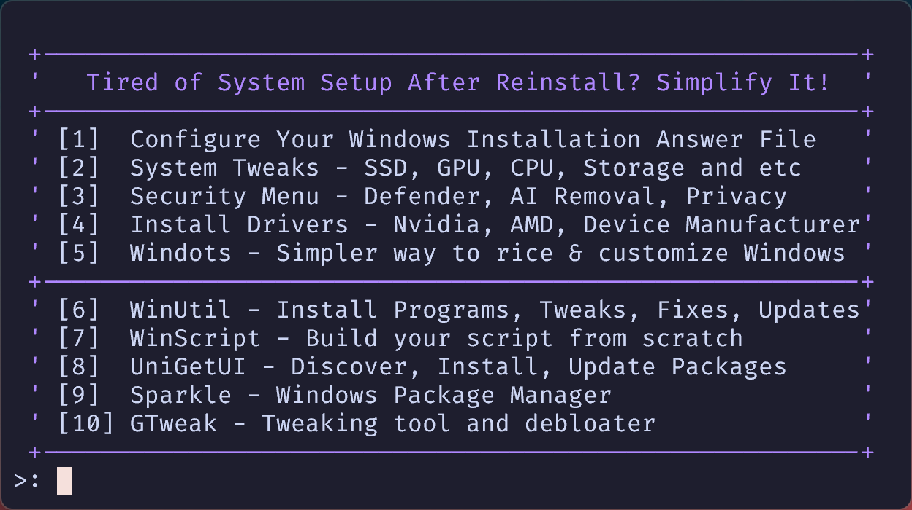
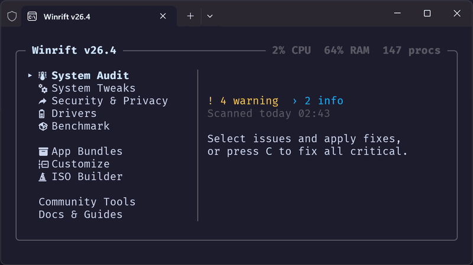
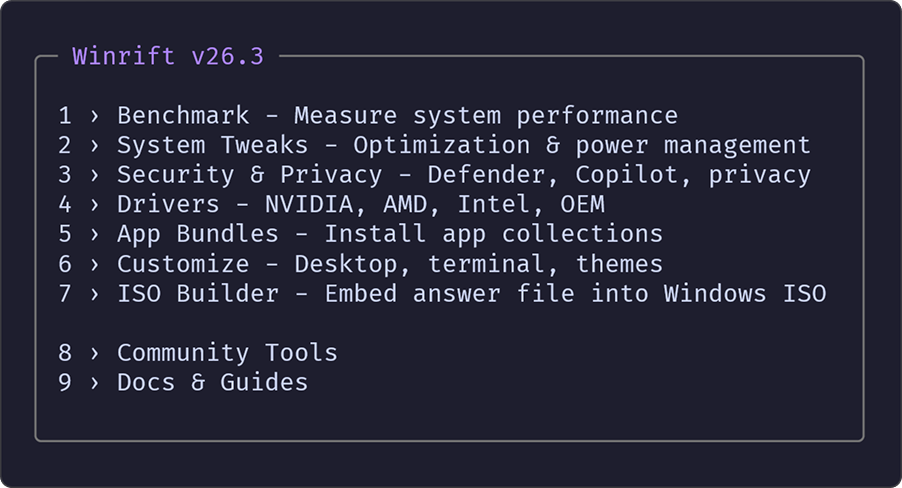

<h1>Winrift </h1>

**Break through default Windows.** Measure every tweak, prove every change — 13 system metrics, before and after.

<p align="center">
	
</p>

<div align="center">
 <p>
 <a href="https://github.com/emylfy/winrift/stargazers"></a>&nbsp;&nbsp;
 <a href="https://github.com/emylfy/winrift/blob/main/LICENSE"></a>&nbsp;&nbsp;
 <a href="https://github.com/emylfy/winrift/commits/main/"></a>&nbsp;&nbsp;
 <a href="https://github.com/emylfy/winrift/releases"></a>
 </p>
</div>

<p align="center">
	<a href="#install">Install</a> •
	<a href="#benchmark--dont-trust-verify">Benchmark</a> •
	<a href="#features">Features</a> •
	<a href="#compatibility">Compatibility</a>
</p>

> **No other tool covers this complete pipeline:** Measure → Optimize → Verify → Customize

<!-- TODO: record demo.gif with ShareX or Windows Terminal screen capture
<p align="center">
	
</p>
-->

---

## Install

Open PowerShell as Admin (`Win + X` → Terminal Admin) and run:

```powershell
irm https://raw.githubusercontent.com/emylfy/winrift/main/scripts/launch.ps1 | iex
```

A restore point is created automatically before any system changes.

<details>
<summary>Create a persistent Start Menu shortcut</summary>

```powershell
irm https://raw.githubusercontent.com/emylfy/winrift/main/scripts/install.ps1 | iex
```

</details>

> **Security note:** This is a common PowerShell install pattern (similar to `curl | sh`). The full source code is open at [github.com/emylfy/winrift](https://github.com/emylfy/winrift). All external scripts are verified with SHA256 hashes before execution.

---

## Benchmark — Don't Trust, Verify

Other tools apply tweaks and hope for the best. Winrift measures 13 system metrics before and after — so you see exactly what changed.

> Typical results on clean Windows 11 24H2 (your numbers will vary):

| Metric | Before | After | Change |
| :--- | ---: | ---: | ---: |
| CPU idle load | 3.2% | 1.1% | -66% |
| RAM usage | 2,800 MB | 2,100 MB | -25% |
| Running processes | 142 | 98 | -31% |
| Running services | 187 | 151 | -19% |
| DPC rate | 48 /s | 22 /s | -54% |
| Context switches | 12,400 /s | 8,600 /s | -31% |

<sub>Full methodology and metric explanations: <a href="docs/tests.md">Testing & Benchmarks Guide</a></sub>

<!-- TODO: screenshot-benchmark.png — capture the benchmark report output at 1920x1080
<p align="center">
	
</p>
-->

---

## Features

<!-- TODO: capture screenshots at 1920x1080
<p align="center">
	&nbsp;&nbsp;
	
</p>
<p align="center">
	&nbsp;&nbsp;
	
</p>
-->

| Feature | What it does |
| :--- | :--- |
| **[Benchmark](docs/tests.md)** | Measure 13 system metrics (CPU, RAM, DPC rate, disk latency, context switches...) before and after tweaks |
| **[System Tweaks](docs/tweaks_guide.md)** | 13 optimization categories — latency, input, SSD/NVMe, GPU scheduling, network, CPU, power, responsiveness, boot, UI, memory, maintenance, DirectX |
| **GPU Tweaks** | NVIDIA and AMD-specific optimizations with automatic device detection; hybrid GPU support |
| **Security & Privacy** | Disable Defender ([DefendNot](https://github.com/es3n1n/defendnot)), remove Copilot/Recall ([RemoveWindowsAI](https://github.com/zoicware/RemoveWindowsAI)), privacy hardening ([privacy.sexy](https://github.com/undergroundwires/privacy.sexy)) |
| **Drivers** | NVIDIA, AMD, Intel DSA auto-install + 9 OEM manufacturers: HP, Lenovo, ASUS, Acer, MSI, Dell, Huawei, Xiaomi, Gigabyte |
| **[Customize](modules/customize/README.md)** | Desktop environment ([GlazeWM](https://github.com/glzr-io/glazewm), [Zebar](https://github.com/glzr-io/zebar), [Flow Launcher](https://github.com/Flow-Launcher/Flow.Launcher), [Windhawk](https://windhawk.net/), [Rainmeter](https://www.rainmeter.net/)), terminal & shell configs, editor configs, app themes (Spotify, Steam, browser), Windows look & feel |
| **App Bundles** | 7 curated winget collections via [UniGetUI](https://github.com/marticliment/UniGetUI) — Development, Browsers, Utilities, Productivity, Creative & Media, Gaming, Communications |
| **[ISO Builder](docs/autounattend_guide.md)** | Embed an answer file into a Windows 11 ISO — automate clean installs with bloatware removal, telemetry disabled, and Winrift ready on first login |
| **[Answer File](docs/autounattend_guide.md)** | Automated Windows 11 install — removes 25 bloatware apps, disables telemetry, cleans taskbar, bypasses TPM/Secure Boot checks |

<details>
<summary><strong>Community Tools</strong> — integrated third-party launchers</summary>

<br>

| Tool | Description |
| :--- | :--- |
| [WinUtil](https://github.com/ChrisTitusTech/winutil) | Install programs, apply tweaks, fixes and updates |
| [WinScript](https://github.com/flick9000/winscript) | Build custom Windows setup scripts |
| [Sparkle](https://github.com/Parcoil/Sparkle) | Optimize and debloat Windows |
| [GTweak](https://github.com/Greedeks/GTweak) | GUI tweaking tool and debloater |

</details>

---

## Why Winrift?

📊 **Benchmark-First** — Captures 13 system metrics before and after every tweak. CPU load, RAM, DPC rate, disk latency — you see the real impact, not guesswork.

🔄 **Full Rollback** — Every registry change is backed up to JSON before it's applied. Combined with an automatic System Restore Point, nothing is permanent unless you want it to be.

🛡️ **Verified Execution** — All external scripts are checked against SHA256 hashes before running. No blind trust, no hidden downloads.

🎨 **Beyond Tweaks** — Full desktop environment setup: tiling window managers, status bars, app launchers, terminal configs, editor themes, Spotify and Steam customization — all from one menu.

💿 **ISO Builder** — Embed an answer file into a Windows 11 ISO to automate clean installs. Removes 25 bloatware apps, disables telemetry, and launches Winrift on first login.

---

## Compatibility

| Windows Version | Status |
| :---: | :---: |
| Windows 11 25H2 | Supported |
| Windows 11 24H2 | Fully tested |
| Windows 11 23H2 | Supported |
| Windows 11 22H2 | Should work |
| Windows 10 | Not supported |

**Requirements:** PowerShell 5.1+ (included with Windows 11), Administrator privileges, Internet connection.

---

## Troubleshooting

| Problem | Solution |
| :--- | :--- |
| Scripts disabled | `Set-ExecutionPolicy RemoteSigned -Scope CurrentUser` |
| Module not found | Re-run the install command for the latest version |
| Registry errors | Check `%USERPROFILE%\Winrift\logs\` for the session log |
| Tweak broke something | Open Winrift → System Tweaks → Restore Backup, or boot from a restore point |
| UniGetUI fails | `winget source reset --force` in admin PowerShell |

---

## Credits

Built on the work of [AlchemyTweaks/Verified-Tweaks](https://github.com/AlchemyTweaks/Verified-Tweaks), [ashish0kumar/windots](https://github.com/ashish0kumar/windots), [ChrisTitusTech/winutil](https://github.com/ChrisTitusTech/winutil), [flick9000/winscript](https://github.com/flick9000/winscript), [Greedeks/GTweak](https://github.com/Greedeks/GTweak), [Parcoil/Sparkle](https://github.com/Parcoil/Sparkle), [marticliment/UniGetUI](https://github.com/marticliment/UniGetUI).

<div align="center">

[MIT License](LICENSE) &bull; [Contributing](CONTRIBUTING.md) &bull; [Report a Bug](https://github.com/emylfy/winrift/issues)

</div>
